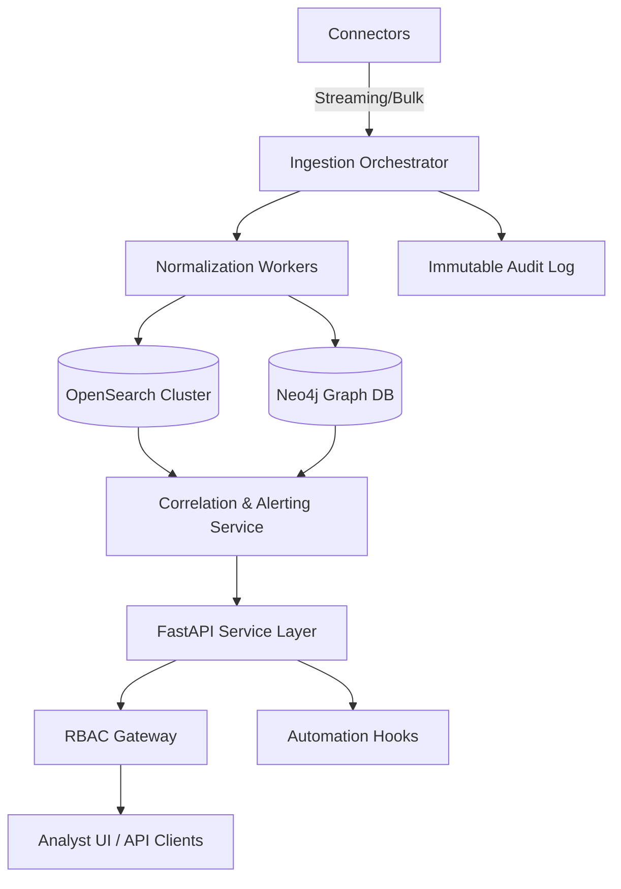

# CreepyAI Modernization Migration Plan

## Objective Alignment
- **Mission**: Deliver a modular, high-velocity intelligence aggregation engine supporting actionable, policy-compliant insights.
- **Scope**: Rebuild ingestion, normalization, correlation, and deployment workflows while upgrading dependencies, observability, and security.
- **Constraints**: Maintain auditability, role-based controls, and immutable evidence handling; remove deprecated libraries; document every change.

## Current System Inventory
| Category | Path / Identifier | Description | External Dependencies | Execution Mode |
| --- | --- | --- | --- | --- |
| GUI Entry | `app/main.py` | Launches CLI/GUI, initializes plugin manager and Qt runtime | PyQt5, plugin registry | CLI/GUI |
| Plugin Registration | `app/plugin_registry.py` | Discovers and registers plugin classes | Yapsy, plugin modules | Import |
| Core Initialization | `app/core/initialization.py` | Configures paths, loads settings, sets up environment | ConfigObj, YAML configs | Import |
| Scheduled Jobs | `app/utilities/task_scheduler.py` | Handles periodic background tasks | `threading`, custom scheduler | Runtime |
| Exporters | `app/exporters/*` | Output to CSV, JSON, PDF | pandas, fpdf | Batch |
| Data Parsers | `app/plugins/*` | Source-specific acquisition logic | `requests`, custom APIs | Batch/Ad-hoc |
| Scripts | `check_plugins.py`, `cleanup_original_plugins.py`, `move_plugins.py`, `fix_plugin_syntax.py`, `inspect_plugin_directories.py`, `generate_ui.sh`, `regenerate_ui.py` | Maintenance utilities for plugin hygiene and UI generation | argparse, PyQt5, filesystem | CLI |
| Tests | `tests/*.py` | Legacy unit tests for plugin registry mapping | pytest | CLI |
| Configurations | `configs/**` | Application configuration files, plugin manifests | YAML, JSON | Runtime |

## Module Classification
| Module / Package | Classification | Rationale |
| --- | --- | --- |
| `app/main.py` | Refactorable | Central entry point needs separation of CLI/GUI concerns and API bootstrap for services. |
| `app/plugin_registry.py` | Replaceable | Yapsy-based plugin loader lacks observability and modern packaging compatibility. |
| `app/plugins` legacy scrapers | Deprecated | Depend on credential prompts and brittle HTML scraping without governance. |
| `app/core` utilities | Refactorable | Path and initialization helpers should expose configuration service and secrets abstraction. |
| `app/utilities/pyqt_manager.py` | Replaceable | GUI bootstrap tied to PyQt desktop only; new architecture shifts to service-first API. |
| `scripts/*` maintenance tools | Refactorable | Need consolidation into orchestrated CLI with shared logging and dry-run controls. |
| `tests/` | Replaceable | Coverage limited to registry mapping; lacks ingestion, normalization, and pipeline verification. |
| `configs/plugins/*.conf` | Deprecated | Static INI files superseded by declarative connector manifests with schema metadata. |
| `resources/samples` | Refactorable | Samples must expand to include anonymized pipeline fixtures for testing. |

## Refactor Plans
### Application Shell (`app/main.py`)
- Extract FastAPI bootstrap (`app/service/api.py`) and CLI entry (`app/cli/__init__.py`) with shared dependency injection container.
- Maintain backward-compatible wrapper script that proxies GUI operations while emitting deprecation warnings.
- Target 90% coverage via CLI smoke tests and API integration tests using `pytest-asyncio`.

### Core Services (`app/core`)
- Introduce configuration provider with layered settings (env vars, files, secrets manager) and centralized logging setup.
- Implement role-based access enforcement hooks and audit logger middleware across services.
- Unit tests to cover configuration fallbacks, RBAC rules, and encryption key rotation scenarios.

### Ingestion (`app/plugins`)
- Sunset brittle HTML scrapers; replace with modular connectors under `app/ingestion` supporting REST, streaming, blockchain, and OSINT feeds.
- Define connector protocol (`BaseConnector`) with retry policies, schema contracts, and integration tests using mocked endpoints and Kafka test containers.

### Normalization & Correlation (`app/models`, `app/data`)
- Create normalization pipelines using Pandas/Arrow for schema mapping, and entity resolution service with configurable scoring.
- Build correlation engine with OpenSearch for time-series and Neo4j for graph analytics, accessible via service layer.
- Provide deterministic fixtures in `tests/integration/` for cross-database verification.

### Observability & Security
- Embed structured logging (`structlog`), OpenTelemetry tracing, Prometheus metrics exporters, and tamper-evident evidence manifests stored via cryptographic digests.
- Add automated safety checklist executed in CI with security scanning (`pip-audit`, `bandit`), dependency diffing, and data handling review prompts.

### Maintenance Tooling (`scripts/*`)
- Consolidate maintenance utilities into `tools/cli.py` with subcommands for plugin hygiene, schema audits, and dataset provisioning while ensuring dry-run modes for each operation.
- Provide compatibility wrappers that forward to the new CLI when legacy scripts are invoked, with logging to the audit trail.
- Achieve 85% coverage through CLI unit tests and smoke tests that operate on fixture directories.

## Target Architecture Overview


## Migration Phases
1. **Audit & Foundations (Weeks 1-2)** — *Resources: 1 lead engineer, 1 security engineer*
   - Freeze deployments, capture current configs, and baseline metrics.
   - Stand up new observability stack and security scanning in CI.
   - Milestone: `M1` approval of architecture blueprint and risk assessment.
2. **Core Refactor (Weeks 3-6)** — *Resources: 2 backend engineers, 1 DevOps engineer*
   - Implement configuration service, FastAPI shell, and modular ingestion interface.
   - Migrate priority connectors (Twitter API v2, Mastodon, RSS, blockchain events) behind feature flags.
   - Milestone: `M2` connector SDK beta with compatibility shims validated.
3. **Data Layer Modernization (Weeks 6-9)** — *Resources: 2 data engineers, 1 database admin*
   - Deploy OpenSearch and Neo4j clusters with Terraform/Helm templates.
   - Implement normalization and entity resolution pipelines with Arrow datasets.
   - Milestone: `M3` dual-write pipelines with parity metrics published.
4. **Security & Compliance (Weeks 9-11)** — *Resources: 1 security engineer, 1 backend engineer*
   - Integrate RBAC, audit logging, evidence hashing, and policy checks.
   - Finalize data retention and privacy configurations.
   - Milestone: `M4` compliance sign-off and audit trail certification.
5. **Validation & Cutover (Weeks 11-12)** — *Resources: 1 SRE, 1 QA engineer*
   - Execute automated test suites, performance benchmarks, and security checklists.
   - Run blue/green deployment with staged rollbacks and operator verification.
   - Milestone: `M5` production release decision with rollback playbooks rehearsed.

## Environment Provisioning
### Conda Environment
```yaml
name: creepyai
channels:
  - conda-forge
dependencies:
  - python=3.11
  - pip
  - nodejs=20
  - pip:
      - -r requirements.txt
```

### Development Dockerfile
```Dockerfile
FROM mcr.microsoft.com/devcontainers/python:3.11

ENV POETRY_VIRTUALENVS_CREATE=false \
    PIP_DISABLE_PIP_VERSION_CHECK=1

RUN apt-get update && apt-get install -y --no-install-recommends \
    build-essential \
    libffi-dev \
    libssl-dev \
    libpq-dev \
    && rm -rf /var/lib/apt/lists/*

WORKDIR /workspace
COPY requirements.txt ./
RUN pip install --no-cache-dir -r requirements.txt
COPY . .

CMD ["uvicorn", "app.service.api:app", "--host", "0.0.0.0", "--port", "8000"]
```

## CI/CD Blueprint
### Test Commands
```bash
pytest --maxfail=1 --disable-warnings -q
pytest tests/integration --asyncio-mode=auto --cov=app
pip-audit
bandit -q -r app
```

### GitHub Actions Workflow Snippet
```yaml
name: ci
on:
  push:
    branches: [main]
  pull_request:

jobs:
  build-test:
    runs-on: ubuntu-latest
    steps:
      - uses: actions/checkout@v4
      - uses: actions/setup-python@v5
        with:
          python-version: '3.11'
      - name: Install dependencies
        run: |
          python -m pip install --upgrade pip
          pip install -r requirements.txt
      - name: Static analysis
        run: |
          pip install pip-audit bandit
          pip-audit
          bandit -q -r app
      - name: Run tests
        run: |
          pytest --maxfail=1 --disable-warnings -q
          pytest tests/integration --asyncio-mode=auto --cov=app
      - name: Upload coverage
        uses: codecov/codecov-action@v4
        with:
          token: ${{ secrets.CODECOV_TOKEN }}

  deploy:
    needs: build-test
    runs-on: ubuntu-latest
    environment: staging
    steps:
      - uses: actions/checkout@v4
      - name: Deploy with Helm
        run: |
          helm upgrade --install creepyai deploy/helm/creepyai -f deploy/helm/values-staging.yaml
      - name: Post-deploy checks
        run: |
          python scripts/verify_deploy.py --environment staging
```

## Testing Strategy
- **Unit Tests**: Cover configuration service, connector SDK validation, RBAC policy enforcement, and evidence hashing utilities using pytest with fixtures in `tests/unit`.
- **Integration Tests**: Exercise ingestion-to-normalization flows with mocked Kafka topics, OpenSearch test containers, and Neo4j sandbox datasets located under `tests/integration`.
- **Smoke Tests**: Execute `scripts/verify_deploy.py` against staging environments to validate API health, RBAC endpoints, and audit log write-read cycles before promotion.
- **Performance Benchmarks**: Run load scenarios via Locust or k6 to ensure correlation engine meets latency SLAs; track metrics in CI artifacts.

## Deployment Strategy
- **Staging**: Deploy via Helm chart with OpenSearch/Neo4j dependencies, enable synthetic data feeds, and validate audit trail integrity.
- **Production (Cloud)**: Execute blue/green rollout, mirror ingestion streams, and promote upon verification of metrics, logs, and alerting stability across Kubernetes clusters.
- **Production (Air-gapped On-Prem)**: Use Terraform to provision bare-metal Kubernetes, seed container registries via signed artifacts, and apply Helm charts with offline values bundles.
- **Rollback**: Helm `rollback` command with state snapshots of OpenSearch/Neo4j indices and Kafka offsets stored in S3-compatible object store or on-prem object storage (MinIO) with immutability locks.

## Verification Checklist
1. Run `scripts/verify_deploy.py --environment <env>` and confirm exit code 0.
2. Confirm Prometheus scrape targets healthy and alertmanager silence cleared.
3. Validate RBAC policies by simulating analyst, auditor, and admin personas through FastAPI endpoints.
4. Inspect audit log manifest for tamper-evident hash continuity and immutable storage acknowledgment.
5. Execute anomaly detection smoke test by replaying synthetic data (`tests/data/anomaly_fixture.json`) and confirm alerts in SIEM feed.
6. Review pip-audit and bandit reports; ensure zero high/critical findings.

## Repo Restructuring Plan
| Action | Target |
| --- | --- |
| Move legacy plugins to `archive/plugins_legacy/` with frozen docs | Phase 1 |
| Introduce `app/ingestion`, `app/pipelines`, `app/service`, `app/security`, `app/observability` packages | Phase 2 |
| Create `deploy/helm`, `deploy/terraform`, and `environments/` directories | Phase 1 |
| Convert scripts into `tools/` CLI package with shared logging | Phase 2 |
| Replace `configs/plugins/*.conf` with YAML manifests under `configs/connectors/` | Phase 2 |

## Automated Safety Checklist Template
```bash
pip-audit --generate-cyclonedx sbom.json
bandit -q -r app
pytest --maxfail=1
python scripts/run_data_handling_review.py --output reports/data_review.json
python scripts/verify_evidence_chain.py --artifact-dir evidence/
```

## Dependency Management Controls
- Generate pinned, hashed requirements using `pip-compile --generate-hashes requirements.in` and commit resulting lockfiles under `requirements/`.
- Store SBOM artifacts produced by `pip-audit --generate-cyclonedx` and `syft packages dir:. -o json=sbom_syft.json` for compliance review.
- Validate package signatures during Docker builds via `pip install --require-hashes` and mirror artifacts in an internal PyPI repository.

## Migration Rollback Plan
- Maintain immutable backups of OpenSearch indices (`_snapshot` repository) and Neo4j dumps prior to each phase.
- Store Kafka consumer offsets and connector configurations in version-controlled secrets store (Vault).
- Provide rollback scripts in `deploy/scripts/rollback_phase_<n>.sh` restoring infra and configs.

## Documentation Deliverables
- `docs/architecture.md`: service diagrams, data flow, security model.
- `docs/runbook.md`: operational procedures, alert responses, and escalation contacts.
- `docs/migration_log.md`: chronological record of decisions, approvals, and risk mitigations.
- `CHANGELOG.md`: versioned summary with semantic headings.

## TODO Roadmap (Prioritized)
1. Build ingestion connector SDK with retryable streaming support (**High**, 3 sprints, risk: API quota limits).
2. Implement RBAC gateway integrated with OAuth2/OIDC (**High**, 2 sprints, risk: SSO policy alignment).
3. Deploy observability stack (Prometheus, Grafana, Loki, OpenTelemetry) (**High**, 2 sprints, risk: infra quotas).
4. Design tamper-evident evidence manifest service (**Medium**, 1 sprint, risk: storage throughput).
5. Implement machine learning anomaly detection hooks with model registry (**Medium**, 2 sprints, risk: data drift).
6. Sunset desktop UI in favor of responsive web console (**Low**, 2 sprints, risk: change management).

## Legacy Module Retention Justification
| Module | Status | Justification | Sunset Target |
| --- | --- | --- | --- |
| `yapsy` plugin loader | Temporary retain | Required until new connector SDK is GA; low security risk when sandboxed. | Post Phase 2 |
| `PyQt5` desktop shell | Temporary retain | Needed for legacy analyst workflow during transition period. | Post Phase 3 |
| `configobj` parser | Temporary retain | Used by legacy configs until fully migrated to Pydantic settings. | Post Phase 2 |

## Risk Register Snapshot
| Risk | Impact | Likelihood | Mitigation |
| --- | --- | --- | --- |
| API rate limit exhaustion | High | Medium | Implement adaptive backoff and cached enrichment layers. |
| Neo4j schema drift | Medium | Medium | Enforce migrations via versioned Flyway scripts and integration tests. |
| Security control gaps during transition | High | Low | Enforce feature flags, RBAC, and audit trail duplication before cutover. |
| Data residency compliance | High | Low | Tag datasets with residency metadata and enforce region-aware storage policies. |

## Acceptance Criteria
- All automated checklists pass with zero high severity findings.
- New ingestion connectors operate without credentials stored in code and honor retry policies.
- Normalization pipeline achieves >95% schema alignment accuracy in integration tests.
- Correlation engine delivers sub-second query responses for benchmark scenarios.
- Documentation, migration logs, and changelog updated before production promotion.

